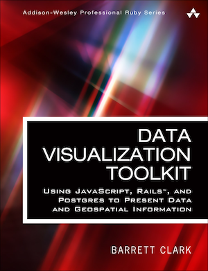

[](https://gitpitch.com/enogrob/ebook-project/master)
```
Roberto Nogueira  
BSd EE, MSd CE
Solution Integrator Experienced - Certified by Ericsson
```
# eBook Visualization Toolkit: Using JavaScript, Rails, and Postgres



**About**

Learn everything you need to about the subject of this `eBook` project.

[Homepage](http://www.informit.com/store/data-visualization-toolkit-using-javascript-rails-and-9780134465227)

## Topics
```
[ ] Foreword xv
[ ] Preface xvii
[ ] Acknowledgments xxiii
[ ] About the Author xxv

Part I: ActiveRecord and D3 1

Chapter 1: D3 and Rails 3
[ ] Your Toolbox—A Three-Ring Circus 3
[ ] Maryland Residential Sales App 5
[ ] Summary 17

Chapter 2: Transforming Data with ActiveRecord and D3 19
[ ] Pie Chart Revisited 19
[ ] Bar Chart 24
[ ] Scatter Plot 28
[ ] Scatter Plot Revisited 33
[ ] Box Plot 34
[ ] Summary 40

Chapter 3: Working with Time Series Data 41
[ ] Historic Daily Weather Data 41
[ ] Weather Rails App 42
[ ] Simple Line Graph 45
[ ] Tweak 1: Simple Multiline Graph 50
[ ] Tweak 2: Add Circle to Highlight the Maximum Temperature 51
[ ] Tweak 3: Add Circle to Highlight the Minimum Temperature 53
[ ] Tweak 4: Add Text to Display the Temperature Change 55
[ ] Tweak 5: Add a Line Between the Focus Circles 56
[ ] Summary 58

Chapter 4: Working with Large Datasets 59
[ ] Git and Large Files 59
[ ] The Cloud 60
[ ] Hotlinking 60
[ ] Benchmarking 62
[ ] Querying “Big Data” 65
[ ] When Benchmarks and Statistics Lie 68
[ ] Summary 69

Part II: Using SQL in Rails 71

Chapter 5: Window Functions, Subqueries, and Common Table Expression 73
[ ] Why Use SQL? 73
[ ] User-Defined Functions 75
[ ] How to Use SQL in Rails 78
[ ] Scatter Plot with Mortgage Payment 79
[ ] Window Functions 81
[ ] Using Subqueries 84
[ ] Common Table Expression 84
[ ] CTE and the Heatmap 86
[ ] Summary 90

Chapter 6: The Chord Diagram 93
[ ] The Matrix Is the Truth 93
[ ] Flight Departures Data 94
[ ] Departures App 95
[ ] Transforming the Data 101
[ ] Create the Views 104
[ ] Draw the Chord Diagram 106
[ ] Disjointed City Pairs 108
[ ] Summary 113

Chapter 7: Time Series Aggregates in Postgres 115
[ ] Finding Flight Segments 115
[ ] Graphing the Timeline 121
[ ] Summary 127

Chapter 8: Using a Separate Reporting Database 129
[ ] Transactional versus Reporting Databases 129
[ ] Working with Multiple Schemas in Rails 131
[ ] Creating Objects in the Reporting Schema 132
[ ] Summary 138

Part III: Geospatial Rails 139

Chapter 9: Working with Geospatial Data in Rails 141
[ ] GIS Primer 141
[ ] PostGIS 144
[ ] ActiveRecord and PostGIS 146
[ ] Using Geospatial Data in Rails 147
[ ] Working with Shapefiles 150
[ ] Summary 154

Chapter 10: Making Maps with Leaflet and Rails 155
[ ] Leaflet 155
[ ] Incorporating Leaflet into Rails to Visualize Weather Stations 157
[ ] Visualizing Airports 163
[ ] Visualizing Zip Codes 168
[ ] Summary 181

Chapter 11: Querying Geospatial Data 183
[ ] Finding Items within a Bounding Box 183
[ ] Writing a Bounding Box Query 184
[ ] Finding Items Near a Point 187
[ ] Calculating Distance 190
[ ] Summary 191
[ ] Afterword 193

Appendix A: Ruby and Rails Setup 195
[ ] Install Ruby 195
[ ] Finalize the Setup 199

Appendix B: Brief Postgres Overview 201
[ ] Installing Postgres 201
[ ] SQL Tools 202
[ ] Bulk Importing Data 202
[ ] The Query Plan 204

Appendix C: SQL Join Overview 207
[ ] Join Example Database Setup 207
[ ] Inner Join 207
[ ] Left Outer Join 208
[ ] Right Outer Join 208
[ ] Full Outer Join 209
[ ] Cross Join 209
[ ] Self Join 209
[ ] Index 211
```
